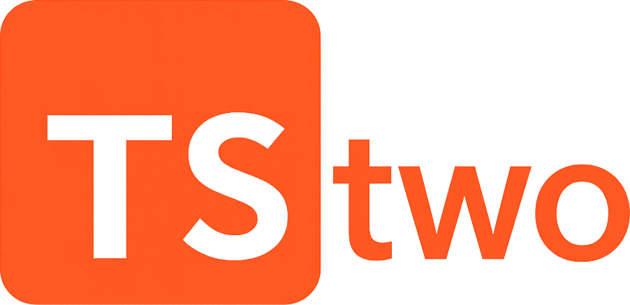

<p align="center">
  
</p>

[](https://opensource.org/licenses/MIT)
[](https://github.com/teddyjfpender/hairy/actions/workflows/ci.yml)

Stwo re-written in TypeScript.

## Structure

- `packages/app`: Main application
- `packages/core`: Shared utilities and core functionality

## Getting Started

```bash
# Install dependencies
bun install

# Run development
bun dev

# Build all packages
bun build

# Run tests
bun test
```

## Working with packages

You can run commands for specific packages:

```bash
# Run only the app in dev mode
bun --cwd packages/app dev

# Build only the core package
bun --cwd packages/core build
```

This project was created using `bun init` in bun v1.2.13. [Bun](https://bun.sh) is a fast all-in-one JavaScript runtime.
